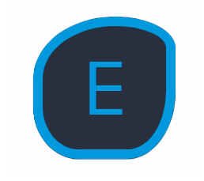

<a name="readme-top"></a>

<!--
HOW TO USE:
This is an example of how you may give instructions on setting up your project locally.

Modify this file to match your project and remove sections that don't apply.

REQUIRED SECTIONS:
- Table of Contents
- About the Project
  - Built With
- Getting Started
- Authors
- Future Features
- Contributing
- Show your support
- Acknowledgements
- License
-->

<div align="center">
  <!-- You are encouraged to replace this logo with your own! Otherwise you can also remove it. -->
  
  <br/>

  <h3><b>Welcome to my project</b></h3>

</div>

<!-- TABLE OF CONTENTS -->

# 📗 Table of Contents

- [📖 About the Project](#about-project)
  - [🛠 Built With](#built-with)
    - [Tech Stack](#tech-stack)
    - [Key Features](#key-features)
- [💻 Getting Started](#getting-started)
  - [Setup](#setup)
  - [Prerequisites](#prerequisites)
  - [Install](#install)
  - [Usage](#usage)
  - [Run tests](#run-tests)
  - [Deployment](#deployment)
- [👥 Authors](#authors)
- [🔭 Future Features](#future-features)
- [🤝 Contributing](#contributing)
- [⭐️ Show your support](#support)
- [🙏 Acknowledgements](#acknowledgements)
- [📝 License](#license)

<!-- PROJECT DESCRIPTION -->

# 📖 [Bookstore] <a name="about-project"></a>

**[Bookstore]** A Bookstore React app is a web application that allows users to browse, search, and Add books online. It provides a user-friendly interface where users can explore a wide range of books, view book details, add books to their cart, and complete the checkout process.

## 🛠 Built With <a name="built-with"></a>

### Tech Stack <a name="tech-stack"></a>

<details>
  <summary>Client</summary>
  <ul>
    <li><a href="https://reactjs.org/">React.js</a></li>
  </ul>
  <ul>
    <li><a href="https://reactjs.org/">CSS</a></li>
  </ul>
</details>


<!-- Features -->

### Key Features <a name="key-features"></a>

- **[Adding preferable books]**
- **[Edit and Comment your book]**

<p align="right">(<a href="#readme-top">back to top</a>)</p>

<!-- GETTING STARTED -->

## 💻 Getting Started <a name="getting-started"></a>

### Prerequisites

In order to run this project you need to run:

```sh
 npm run start 
```

### Setup

Clone this repository to your desired folder using these commands:

```sh
 $ git clone https://github.com/otmaneechchafyky/bookstore.git
 $ cd bookstore
```

 ### Install

Install this project with by running:


```sh
  cd bookstore
  gem install
```

### Run tests

To run tests, run the following command:

```sh
  npm test [file name]
```

### Deployment

You can deploy this project using:

Example:

```sh
  - Render
  - Netlify
```

<p align="right">(<a href="#readme-top">back to top</a>)</p>

<!-- AUTHORS -->

## 👥 Authors <a name="authors"></a>


👤 **Otmane Echchafyky**

- GitHub: [@otmaneechchafyky](https://github.com/otmaneechchafyky)
- Twitter: [@EchchafykyO](https://twitter.com/EchchafykyO)
- LinkedIn: [otmane-echchafyky](https://www.linkedin.com/in/otmane-echchafyky-125801248/)

<p align="right">(<a href="#readme-top">back to top</a>)</p>

<!-- FUTURE FEATURES -->

## 🔭 Future Features <a name="future-features"></a>

- [ ] **[New Routes]**
- [ ] **[New Animation]**

<p align="right">(<a href="#readme-top">back to top</a>)</p>

<!-- CONTRIBUTING -->

## 🤝 Contributing <a name="contributing"></a>

Contributions, issues, and feature requests are welcome!

Feel free to check the [issues page](https://github.com/otmaneechchafyky/bookstore/issues).

<p align="right">(<a href="#readme-top">back to top</a>)</p>

<!-- SUPPORT -->

## ⭐️ Show your support <a name="support"></a>

If you like this project give it a ⭐️ to keep us motivated.

<p align="right">(<a href="#readme-top">back to top</a>)</p>

<!-- ACKNOWLEDGEMENTS -->

## 🙏 Acknowledgments <a name="acknowledgements"></a>


I would like to thank Microverse community.

<p align="right">(<a href="#readme-top">back to top</a>)</p>

<!-- LICENSE -->

## 📝 License <a name="license"></a>

This project is [MIT](./LICENSE) licensed.

<p align="right">(<a href="#readme-top">back to top</a>)</p>
